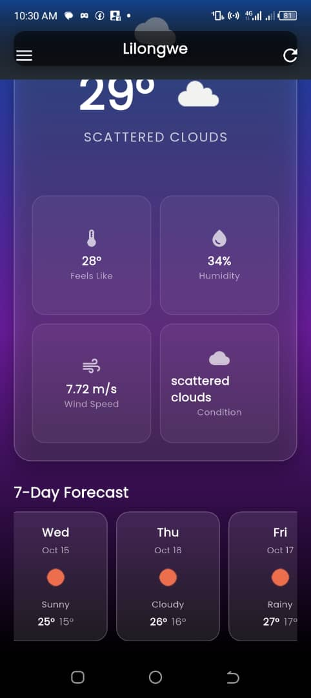
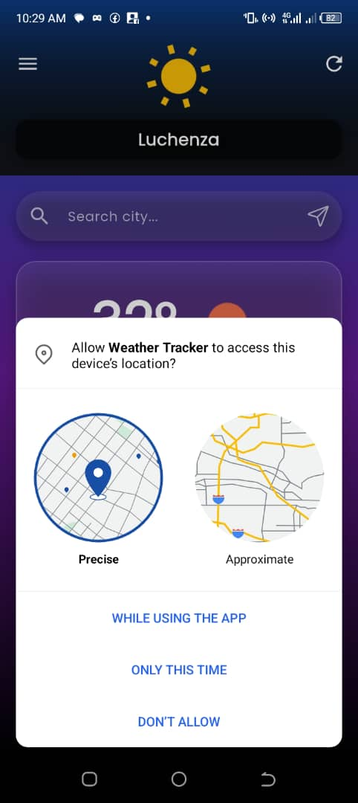
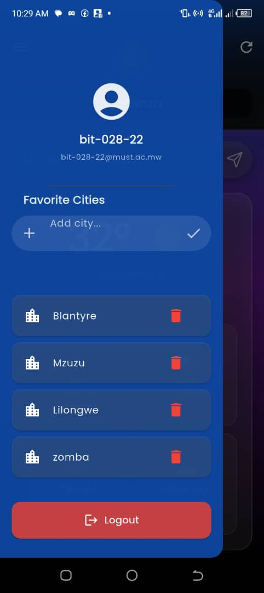

---

````markdown
# 🌦️ Weather Tracker App

A sleek and modern weather application built with **Flutter**, **Firebase**, and **OpenWeatherMapApi**,designed to help university students stay updated with real-time weather information.  
It offers a smooth user experience, simple authentication, and beautiful visuals inspired by **glassmorphism** design.


---

## 📱 App Preview

| Welcome | Authentication | Home | Location | Favorites |
|----------|----------------|------|-----------|------------|
|  |  |  |  |  |


---

## ✨ Key Features

### 🌤️ Weather & Location
- Real-time weather updates with a 7-day forecast  
- Auto-detects your current location  
- Search and view weather for any city worldwide  

### ❤️ Personalization
- Save favorite cities for quick access  
- Smooth animations and gradient UI  
- Works even with limited internet (basic offline cache)  

### 🎓 Student Authentication
- Login using your **Student ID** (e.g. `bit-001-22`)  
- **Phone number as password** for simple, secure access  
- Firebase-backed authentication and data storage  

---

## 🚀 Getting Started

### Requirements
- Flutter SDK (3.19 or newer)  
- Firebase project setup  
- OpenWeatherMap API key  

### Installation
```bash
git clone https://github.com/austhedze/weather-tracker.git
cd weather-app-source-code
flutter pub get
flutter run
````

Set up Firebase and place your `google-services.json` file in `android/app/`.
Add your OpenWeatherMap API key in `lib/services/weather_service.dart`.

---

## 📋 How It Works

1. Register with your student ID and phone number
2. View your location’s current weather instantly
3. Search and add cities to your favorites
4. Check forecasts for the upcoming week

---

## 🧩 Tech Overview

* **Frontend:** Flutter (Material & Glassmorphism UI)
* **Backend:** Firebase Authentication + Firestore
* **API:** OpenWeatherMap
* **State Management:** Flutter Streams

---

## 📁 Folder Highlights

```
lib/
├── models/           # Weather data models
├── services/         # Firebase, weather, and location logic
├── screens/          # UI screens (login, home, etc.)
├── widgets/          # Reusable components (cards, lists)
└── app.dart          # App configuration
```

---

## 🧪 Basic Testing Checklist

* ✅ Register & login
* ✅ Fetch weather data
* ✅ City search works
* ✅ Favorites save correctly
* ✅ Displays 7-day forecast

Run:

```bash
flutter test
```

---

## 📝 License

Licensed under the **MIT License** — see the [LICENSE](LICENSE) file for details.

---

## 🙏 Acknowledgments

Special thanks to:

* **OpenWeatherMap** – Weather data provider
* **Flutter & Firebase Teams** – Core development frameworks
* **Material Design** – UI inspiration

---

Made with 💙 by Austin Thedzengwa

```

---

```
